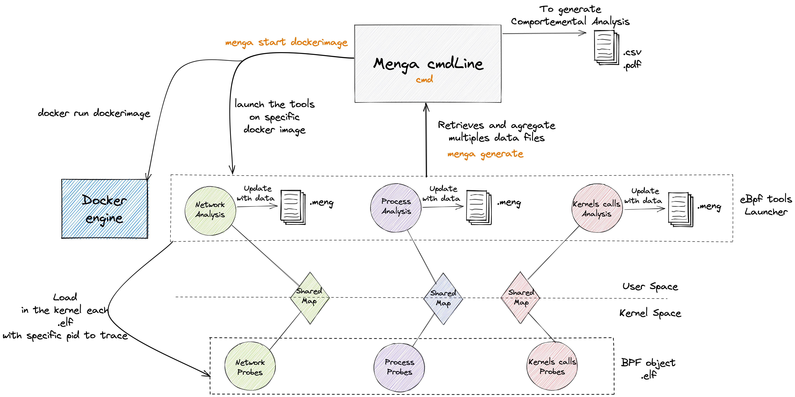
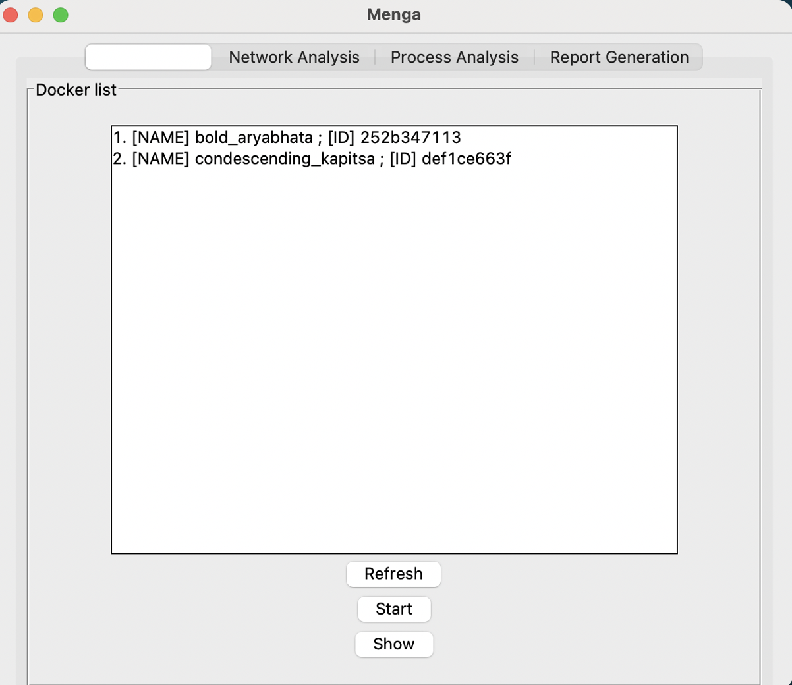
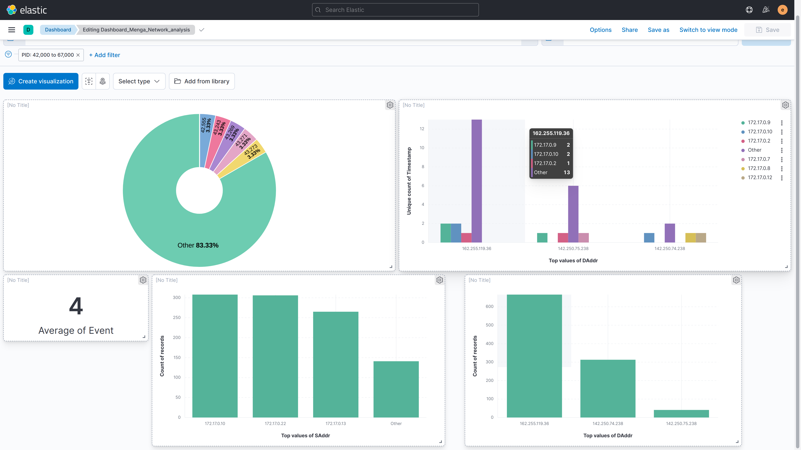

# Menga

When we download a docker image, and run it as a container, we have no guarantee on its malicious behavior or not. Indeed, docker images are regularly uploaded on public repositories open to everyone. So, an attacker can publish a malicious docker image on a public repository. This image could then be downloaded by a developer or an ops and executed on his infrastructure.


Menga is an application that aims to analyze the behavior of docker containers running on a given infrastructure with the objective of detecting potentially malicious behavior of these containers:

    - Illegal or unsolicited network traffic

    - Suspicious CPU consumption (crypto-mining)

    - Suspicious kernel calls


The project is based on ebpf technology which allows for a wide variety of hook and probe functionality.

# V1


Based on probes of https://github.com/iovisor/bcc

## Dependencies

```python
 pip3 install bcc, python-docx, cairosvg, Elasticsearch, docker
```

## Cmd Line

Time Based Mode
```python
 sudo python3 menga.py -dt 30 -o result.csv -i alpinetest
```

Real Time Mode

```python
 sudo python3 menga.py -rt -o result.csv -i alpinetest -u elastic -p changeMe -ip localhost -id menga-network
```




## UI



## ElasticSearch


